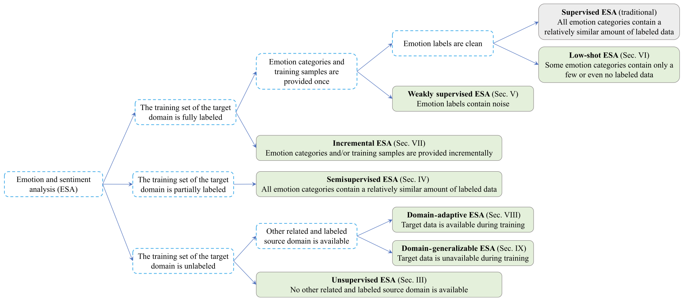

# 📖 ACM MM Tutorial on Label Efficient Emotion and Sentiment Analysis

Welcome to our tutorial **Label Efficient Emotion and Sentiment Analysis** (LeESA) presented at the [ACM MultiMedia conference 2024](https://2024.acmmm.org), in Melbourne, Australia.

## 💻 Material Availability: 
Slides, Videos, Papers are available [here](https://pan.baidu.com/s/1mGTCrQIjWUBIpXeA0sAm8A?pwd=u5qd), with code u5qd.

## 🔲 LeESA Outline:

## ✉️ Learn More:

**Sicheng Zhao**: [Publication List](https://scholar.google.cz/citations?user=LJiQRJIAAAAJ&hl=zh-CN&oi=ao), [Personal Website](https://www.bnrist.tsinghua.edu.cn/info/1091/3072.htm), [Email](schzhao@tsinghua.edu.cn)

**Guoli Jia**: [Publication List](https://scholar.google.cz/citations?user=A6V0JDAAAAAJ&hl=zh-CN), [Personal Website](https://exped1230.github.io), [Email](exped1230@gmail.com)

**Zhicheng Zhang**: [Publication List](https://scholar.google.cz/citations?hl=zh-CN&user=NcTLUzIAAAAJ), [Personal Website](https://zzcheng.top), [Email](gloryzzc6@sina.com)

**Xiaopeng Hong**: [Publication List](https://scholar.google.cz/citations?user=x3X-qysAAAAJ&hl=zh-CN&oi=ao), [Personal Website](https://hongxiaopeng.com), [Email](hongxiaopeng@hit.edu.cn)

**Yanyan Zhao**: [Publication List](https://scholar.google.cz/citations?hl=zh-CN&user=mEdfAYoAAAAJ), [Personal Website](http://homepage.hit.edu.cn/yanyan), [Email](yyzhao1983@126.com)

**Jufeng Yang**: [Publication List](https://scholar.google.cz/citations?hl=zh-CN&user=c5vDJv0AAAAJ), [Personal Website](https://cv.nankai.edu.cn), [Email](yangjufeng@nankai.edu.cn)

**Jianhua Tao**: [Publication List](https://dblp.org/pid/46/2916-1.html), [Personal Website](https://www.au.tsinghua.edu.cn/info/1080/3219.htm), [Email](jhtao@tsinghua.edu.cn)

## 🗒️ Note:

⭐️⭐️ If you are interested in Multi-modal Generation, AIGC + Affective Computing, welcome to [contact with me](exped1230@gmail.com).
